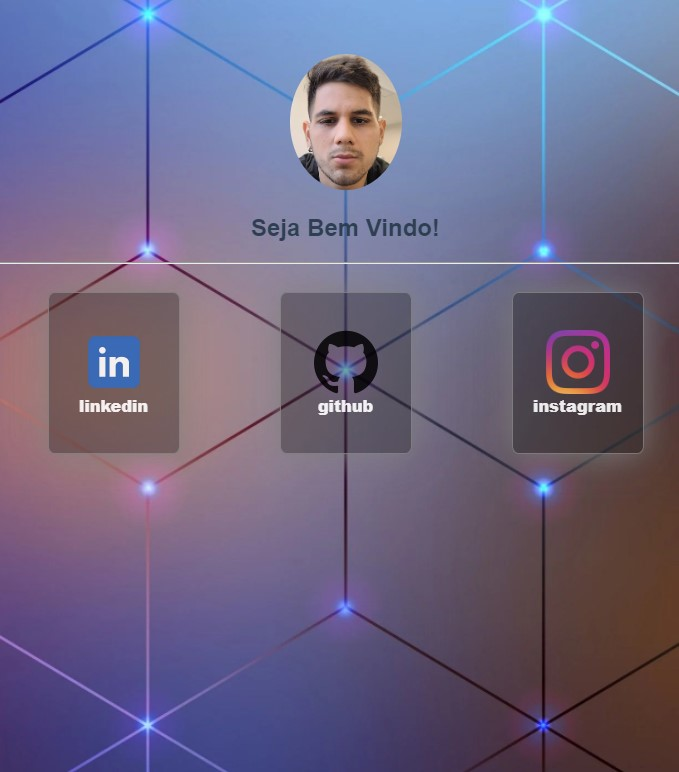

# Link_Tree  

[//]:<> (../master/assets/img/print.png) 
## Projeto Link Tree agr com Vue CDN👈 
    

## Click para ver: <a href='https://joaogabrielz.github.io/linktreeJG/'>Deploy</a> 👈 

### Tecnologias usadas 👈 
 HTML ,  CSS ,  JAVASCRIPT ,  VUE JS ,  VsCode 

- Projeto responsivo  �
    - feito para testar conhecimento em vue
